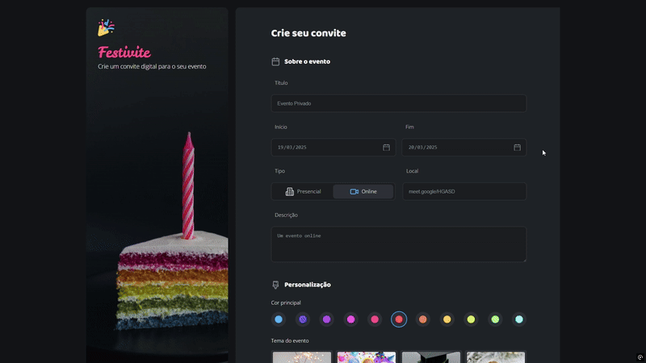

# Formulário de Cadastro

Este é um projeto de estudo desenvolvido durante os cursos da plataforma [Rocketseat](https://www.rocketseat.com.br/). O objetivo deste projeto é praticar e aprimorar conhecimentos em HTML, CSS  criando um formulário de cadastro interativo.

## 🚀 Tecnologias Utilizadas

- HTML5
- CSS3

## 📌 Funcionalidades

- Formulário de cadastro com validação de campos
- Estilização moderna utilizando CSS

## 🔧 Como Executar o Projeto

1. Clone este repositório:
   ```sh
   git clone https://github.com/micaelleitee/projeto-formulario.git
   ```
2. Acesse o diretório do projeto:
   ```sh
   cd projeto-formulario
   ```
3. Abra o arquivo `index.html` no seu navegador.

## 📷 Preview




## 📜 Licença

Este projeto é apenas para fins de estudo e não possui uma licença definida.

---

Feito por [Micael Leite](https://github.com/micaelleitee/) durante os estudos na Rocketseat.

